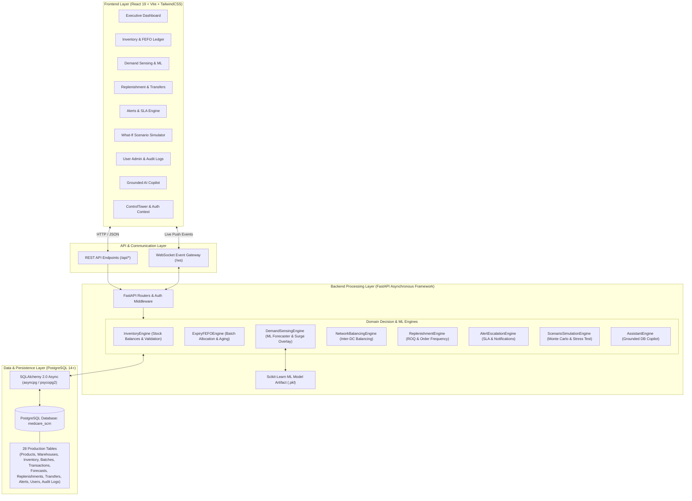
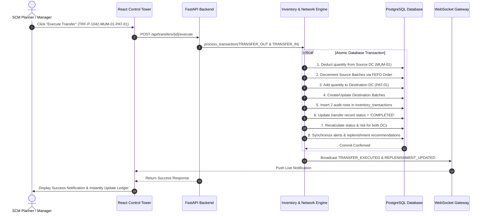
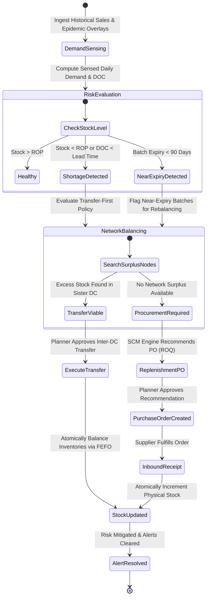

# MedCare Pharma Supply Chain Control Tower

[](https://fastapi.tiangolo.com)
[](https://react.dev)
[](https://www.postgresql.org)
[](https://vitejs.dev)
[](https://tailwindcss.com)
[](https://www.sqlalchemy.org)
[](https://www.python.org)
[](LICENSE)

> **Enterprise-Grade Multi-Echelon Pharmaceutical Supply Chain Intelligence & Control Platform**  
> Unifying real-time inventory visibility, batch-level FEFO expiry management, multi-factor ML demand sensing, transfer-first network balancing, SLA-governed shortage escalations, and explainable replenishment optimization backed by a live **PostgreSQL** database.

---

## 📋 Table of Contents

1. [Project Overview](#-project-overview)
2. [Key Features](#-key-features)
3. [System Architecture](#-system-architecture)
4. [Technology Stack](#-technology-stack)
5. [Application Modules](#-application-modules)
6. [Database Schema & Source of Truth](#-database-schema--source-of-truth)
7. [Data Flow Architecture](#-data-flow-architecture)
8. [Inventory & Stock Synchronization](#-inventory--stock-synchronization)
9. [Business SCM Workflow](#-business-scm-workflow)
10. [User Roles & Permissions (RBAC)](#-user-roles--permissions-rbac)
11. [API Overview](#-api-overview)
12. [Project Structure](#-project-structure)
13. [Prerequisites](#-prerequisites)
14. [Installation & Setup](#-installation--setup)
15. [Environment Variables](#-environment-variables)
16. [Database Setup & Seeding](#-database-setup--seeding)
17. [Running the Application](#-running-the-application)
18. [Automated Testing](#-automated-testing)
19. [Screenshots](#-screenshots)
20. [Troubleshooting](#-troubleshooting)
21. [Project Status](#-project-status)
22. [Future Enhancements](#-future-enhancements)
23. [License](#-license)

---

## 🌟 Project Overview

### What the System Does
The **MedCare Pharma Supply Chain Control Tower** is a centralized decision-support and execution platform designed for multi-tier pharmaceutical distribution networks. It bridges physical distribution centers (Mother DCs, Tier-1 DCs, Regional DCs) with algorithmic intelligence to eliminate blind spots across hospital, pharmacy, and distributor fulfillment channels.

### The Business Problem It Solves
Pharmaceutical supply chains operate under stringent regulatory constraints, cold-chain dependencies, and life-critical service level requirements. Key industry challenges addressed include:
* **High Stockout Frequencies & Lost Sales**: Inability to anticipate sudden epidemic spikes or regional seasonal surges (e.g., flu outbreaks, monsoon ailments).
* **Massive Expiry Waste & Write-offs**: Sub-optimal inventory consumption patterns that violate First-Expiry, First-Out (FEFO) policies.
* **Network Stock Imbalance & Reactive Procurement**: Placing emergency purchase orders with suppliers while sister distribution centers hold surplus, near-expiry inventory.
* **Delayed Shortage Escalations**: Lack of real-time multi-tier SLA cadences to alert operational planners and executives before stockouts impact patient care.
* **Opaque Planning Decisions**: Traditional black-box ERP algorithms that do not provide clear operational justifications for purchase quantities or order timing.

### Intended Business Roles & Users
* **Supply Chain Planners**: Monitor daily demand velocity, review algorithmic replenishment suggestions, and schedule network transfers.
* **Inventory & Warehouse Managers**: Manage DC capacity, execute stock receipts/adjustments, fulfill sales orders, and audit batch aging.
* **Procurement Officers**: Approve and track purchase orders with pharmaceutical manufacturers and suppliers.
* **Executive Leadership & CFOs**: Evaluate network inventory valuation, service levels (OTIF), expiry risk exposure, and working capital efficiency.
* **System Administrators**: Govern role-based access, manage user provisioning, and monitor system health and audit logs.

---

## 🚀 Key Features

* **Executive Control Tower Dashboard**: High-level KPI aggregations (Total Inventory Value, Active Shortage Alerts, Near-Expiry Exposure, Inter-DC Balancing Savings), demand-versus-inventory trajectory forecasts, top at-risk SKU monitoring, and 1-click executive action execution.
* **Real-Time Multi-Tier Inventory Ledger**: SKU-level and DC-level stock balance tracking (`current_stock`, `reserved_stock`, `inbound_stock`, `days_of_cover`), dynamic stock status indicators (`HEALTHY`, `LOW_STOCK`, `CRITICAL`, `OUT_OF_STOCK`, `OVERSTOCK`), and CSV export.
* **Batch-Level FEFO Expiry Tracking**: Granular tracking of batch numbers, manufacturing dates, and expiration dates with risk stratification (`<30d Critical`, `30-60d At Risk`, `61-90d Warning`, `91-180d Watch`, `>180d Normal`).
* **Algorithmic Demand Sensing & Surge Classifier**: Machine learning time-series regression (`RandomForestRegressor`) incorporating 90-day demand history, day-of-week seasonality, hourly patterns, and forward event overlays (+60% flu season uplift, monsoon spikes, regional promotions).
* **Explainable Replenishment Optimizer**: Automatically computes Recommended Order Quantities (ROQ), safety stock buffers, and ordering cadences with 4-part transparent reasoning (*What*, *Why*, *When*, and *Financial/Service Impact*).
* **Transfer-First Network Balancing Engine**: Proactively detects inter-DC transfer opportunities, prioritizing surplus and near-expiry stock from mother DCs (e.g., MUM-01) to fulfill critical deficits in regional DCs (e.g., PAT-01, DEL-02) before committing new procurement expenditure.
* **SLA-Governed Alert Escalation Engine**: Real-time triage of stockout, shortage, and expiry risks across structured SLA response tiers (**Critical: 4 Hours**, **High: 24 Hours**, **Medium: 72 Hours**) with multi-channel dispatch logs (Email, SMS, WhatsApp).
* **Distribution Center Network Management**: Multi-tier logistics facility tracking (capacity, space utilization %, operational health scores, coordinates, lead times) with full DC lifecycle management.
* **Parametric What-If Scenario Simulator**: Stress-tests the supply chain against simulated demand shocks (-50% to +100%), supplier lead time delays (+0 to +14 days), and capacity bottlenecks, projecting stockout values and service level impacts over a 16-week horizon.
* **Financial Valuation & Audit Reports**: Multi-dimensional report generator filterable by DC, category, and time window with interactive valuation curves and 1-click CSV report export.
* **Grounded AI Supply Chain Copilot**: Context-aware assistant querying live PostgreSQL database state for instant natural-language inventory insights, shortage diagnoses, and transfer guidance.
* **Enterprise Role-Based Access Control (RBAC) & Audit Trail**: Granular permission matrix, secure JWT authentication, password management, and immutable system audit logging.
* **Real-Time WebSocket Event Pipeline**: Duplex communication broadcasting transaction receipts, transfer completions, alert status updates, and replenishment recalculations across all connected clients.

---

## 🏗 System Architecture

The application follows a modern decoupled client-server architecture. The asynchronous FastAPI backend coordinates domain-specific decision engines, interfacing directly with a high-performance **PostgreSQL** relational database.



---

## 🛠 Technology Stack

| Technology | Purpose in System | Verified Version |
|---|---|---|
| **PostgreSQL** | Primary relational database, data persistence, and ultimate source of truth | `14.0+` (14 / 15 / 16) |
| **FastAPI** | High-performance asynchronous backend web framework | `>=0.110.0` |
| **Python** | Core backend execution runtime | `>=3.10` (3.10 / 3.11 / 3.12 / 3.13) |
| **SQLAlchemy** | Async Object Relational Mapper (ORM) | `>=2.0.28` |
| **asyncpg** | High-speed asynchronous PostgreSQL database driver | `>=0.29.0` |
| **psycopg2-binary**| Synchronous PostgreSQL client and utility driver | `>=2.9.9` |
| **aiosqlite** | High-speed zero-config SQLite driver (development fallback) | `>=0.20.0` |
| **Pydantic / Pydantic Settings** | Request/response data validation and environment settings management | `>=2.6.0` / `>=2.2.0` |
| **Scikit-Learn** | Machine learning engine for demand forecasting (`RandomForestRegressor`) | `>=1.4.0` |
| **Pandas / NumPy** | Time-series data preparation, feature engineering, and matrix operations | `>=2.2.0` / `>=1.26.0` |
| **Statsmodels** | Statistical time-series decomposition and metrics evaluation | `>=0.14.0` |
| **WebSockets** | Real-time bi-directional event broadcast to connected clients | `>=12.0` |
| **React** | Component-based interactive user interface framework | `^19.2.8` |
| **Vite** | Frontend tooling, development server, and build pipeline | `^8.2.0` |
| **Tailwind CSS** | Utility-first responsive styling and UI layout design | `^3.4.19` |
| **React Router DOM**| Client-side routing, navigation, and protected route guards | `^7.18.2` |
| **Recharts** | Composited responsive charts (Line, Area, Bar, Pie, Heatmaps) | `^3.10.1` |
| **Lucide React** | Enterprise icon suite for medical and supply chain UI | `^1.33.0` |
| **Pytest / Pytest-Asyncio** | Automated unit, integration, and ML pipeline test suite | `>=8.0.0` / `>=0.23.0` |

---

## 📦 Application Modules

### 1. Executive Dashboard (`/`)
* **Live DC Filter & Aggregated Rollup**: Filter by specific Distribution Center (e.g., `MUM-01`, `DEL-02`, `PAT-01`) or view the unified network rollup (`All`).
* **Executive SCM KPIs**: Real-time computation of Total Inventory Value, Active Shortage Alerts, Near-Expiry Risk Exposure, and Inter-DC Transfer Savings.
* **Demand vs. Inventory Trajectory Curve**: Visualizes 8 weeks of historical actual demand, 4 weeks of forward ML forecasted demand, and projected stock trajectory.
* **1-Click Recommendation Action Handler**: Direct button to execute prioritized inter-DC stock balancing or approve critical replenishment orders.
* **Top At-Risk SKUs & Facility Health Grid**: Real-time listing of critically low items and operational health scores for all DCs.

### 2. Real-Time Inventory & FEFO Ledger (`/inventory`)
* **Product Catalog & SKU Rollup**: Filterable multi-echelon table displaying current physical stock, reserved stock, inbound transit stock, ROP, safety stock, and days of cover.
* **Add New Product Modal**: Commission new pharmaceutical SKUs with therapeutic category, unit cost, shelf life, minimum order quantity (MOQ), and threshold settings.
* **Record Sale Modal**: Process customer or hospital sales orders with atomic inventory deductions and automatic FEFO batch allocation.
* **Record Stock Transaction Modal**: Execute Receipts, Adjustments, Consumptions, and Transfers with validation against zero stockouts.
* **Batch Aging & Financial Value Breakdown**: Visual summary of batch aging tiers (`0-30d`, `31-60d`, `61-90d`, `91-180d`, `180+d`) and total capital at risk.
* **Historical Audit Ledger**: Searchable, time-stamped log of all stock movements with previous/new balances and operator attribution.

### 3. Sensed Demand Forecasting (`/demand-forecast`)
* **Multi-Factor Demand Sensing Signals**: Real-time signal overlay cards (e.g., Flu season epidemic, monsoon respiratory surge, regional festival stockpile) displaying impact percentages and algorithm confidence scores.
* **ML Model Lineage & Transparency**: Full inspection panel detailing active algorithm (`RandomForestRegressor`), training samples, temporal train/val split, R² score, MAE, RMSE, and WAPE error metrics.
* **Ordering Velocity Patterns**: Visual day-of-week and hourly ordering velocity heatmaps.
* **Pipeline Controls**: Action triggers to manually run demand forecast updates or retrain the machine learning model on updated sales history.

### 4. Replenishment & Network Balancing Optimizer (`/replenishment`)
* **Overview Tab**: Sensed replenishment recommendations with explainable 4-part justifications (*What*, *Why*, *When*, *Impact*), Recommended Order Quantity (ROQ), suggested order frequency, and 1-click Approve/Reject handlers.
* **Inter-DC Transfers Tab**: Discovered stock rebalancing opportunities matching excess/near-expiry stock in mother DCs with shortage nodes, showing estimated logistics savings in INR.
* **Purchase Orders Tab**: Historical and active supplier purchase orders with vendor names, quantities, unit prices, ETAs, and fulfillment statuses.
* **FEFO Batches Tab**: Granular inspection of active batches across warehouses with remaining shelf life and available quantities.
* **Parameter Configuration Tab**: View and adjust target service levels, lead time buffers, and approval financial thresholds.

### 5. Alert & Escalation Engine (`/alerts`)
* **SLA-Tiered Shortage Alerts**: Severity grouping across **Critical (4h SLA)**, **High (24h SLA)**, and **Medium (72h SLA)** with real-time countdown timers.
* **Triage Action Handlers**: "Acknowledge", "Escalate SLA Tier", and "Mark Resolved" workflows updating database records and broadcasting push notifications.
* **Root Cause Diagnostics**: Root cause breakdowns (e.g., Sudden Demand Surge, Delayed Inbound Shipment, Expiry Depletion) with dynamic distribution charts.
* **Escalation Audit History**: Log of all tier escalations, designated owners, and SLA compliance timestamps.

### 6. Distribution Centers & Logistics Facilities (`/warehouses`)
* **Facility Network Grid**: Operational metrics across all distribution hubs, including physical storage capacity, utilization percentage, health score, and lead times.
* **Add / Edit Facility Modal**: Commission, reconfigure, or update storage capacity and geographic map coordinates for any warehouse node.
* **Geographic Network Map**: Interactive spatial visualization of warehouse hubs and logistics supply routes.

### 7. Financial ROI & Valuation Audit (`/reports`)
* **Multi-Dimensional Query Filters**: Filter analytical reports by Report Type, Distribution Center, Therapeutic Category, and Time Window (7, 14, 30, or 90 days).
* **Live Inventory Valuation Curve**: Time-series curve tracking total inventory value versus capital exposed to near-expiry write-offs.
* **1-Click CSV Export**: Download formatted operational and financial audit reports for executive presentations.

### 8. What-If Scenario Simulator (`/scenario-simulator`)
* **Parametric Stress-Testing Controls**: Sliders to simulate demand shocks (-50% to +100%), supplier lead-time delays (0 to +14 days), initial inventory shocks, and DC capacity constraints.
* **Comparative Baseline vs. Shock Analysis**: Direct comparison of projected stockout SKUs, financial stockout losses, average customer service level %, and replenishment capital required.
* **16-Week Projected Trajectory**: Line graph tracking projected inventory levels and stockout occurrences over a 4-month horizon.
* **Scenario History Log**: Historical repository of previous simulation runs for strategic planning review.

### 9. Grounded AI Supply Chain Copilot (Assistant Widget)
* **Natural Language Copilot**: Grounded natural language query engine querying the live PostgreSQL database for instant stock checks, batch expiry audits, shortage explanations, and transfer suggestions.
* **Suggested Actions**: Context-aware follow-up action prompts allowing planners to execute transfers or navigate directly to impacted SKUs.

### 10. User Management, RBAC & Audit Trail (`/users` — Admin Only)
* **Account Administration**: Create, update, activate/deactivate user accounts, and assign user roles (`ADMIN` or `MANAGER`).
* **Password Management**: Administrative password reset modal with temporary credential generation.
* **Immutable System Audit Logs (`/api/audit-logs`)**: Searchable audit log capturing every administrative mutation, affected module, entity ID, before/after values, client IP address, and UTC timestamp.

### 11. System Settings (`/settings`)
* **SCM Engine Configuration**: Administrative interface to inspect and configure global operational parameters (e.g., Service Level targets, Lead Time Buffers, Expiry Warning Thresholds, Auto-Approval Financial Limits).

---

## 🗄 Database Schema & Source of Truth

The **PostgreSQL database (`medcare_scm`)** is the ultimate source of truth for all business-critical state, historical transactions, machine learning inputs, and audit trails.

### Core Database Tables (28 Relational Entities)

```mermaid
erDiagram
    products ||--o{ inventory : "stocks"
    products ||--o{ batches : "contains"
    products ||--o{ inventory_transactions : "logs"
    products ||--o{ sales_orders : "fulfills"
    products ||--o{ demand_history : "records"
    products ||--o{ forecasts : "projects"
    products ||--o{ replenishment_recommendations : "generates"
    products ||--o{ purchase_orders : "procures"
    products ||--o{ inventory_transfers : "moves"
    products ||--o{ alerts : "triggers"

    warehouses ||--o{ inventory : "houses"
    warehouses ||--o{ batches : "stores"
    warehouses ||--o{ inventory_transactions : "audits"
    warehouses ||--o{ sales_orders : "ships_from"
    warehouses ||--o{ forecasts : "forecasted_at"
    warehouses ||--o{ replenishment_recommendations : "replenishes"
    warehouses ||--o{ purchase_orders : "receives"
    warehouses ||--o{ inventory_transfers : "source_or_dest"
    warehouses ||--o{ alerts : "originates_at"

    alerts ||--o{ escalations : "escalates_to"
    alerts ||--o{ notifications : "dispatches"
    
    scenarios ||--o{ scenario_results : "produces"

    roles ||--o{ role_permissions : "grants"
    permissions ||--o{ role_permissions : "assigned_to"
    roles ||--o{ users : "governs"
```



| Table Name | Primary Key | Purpose & Business Logic |
|---|---|---|
| **`products`** | `sku` (VARCHAR) | Master catalog of pharmaceutical SKUs, therapeutic categories, shelf lives, unit costs, MOQs, and default ROP/safety stock thresholds. |
| **`warehouses`** | `id` (VARCHAR) | Multi-tier distribution centers (Mother DC, Tier-1 DC, Tier-2 DC), capacity in units, utilization %, health scores, and lead times. |
| **`inventory`** | `id` (SERIAL) | Dynamic inventory balances per SKU per DC (`current_stock`, `reserved_stock`, `inbound_stock`, `days_of_cover`, status, risk level). Unique constraint on `(sku, warehouse_id)`. |
| **`batches`** | `id` (VARCHAR) | Granular batch-level tracking with manufacturing date, expiration date, quantity, status (`ACTIVE`, `NEAR_EXPIRY`, `EXPIRED`, `DEPLETED`), and quarantine flags. |
| **`inventory_transactions`** | `id` (SERIAL) | Immutable audit trail for all stock mutations (`SALE`, `RECEIPT`, `ADJUSTMENT`, `TRANSFER_OUT`, `TRANSFER_IN`, `CONSUMPTION`) with before/after balances. |
| **`sales_orders`** | `id` (VARCHAR) | Hospital, distributor, and pharmacy customer sales orders fulfilled through the network. |
| **`demand_history`** | `id` (SERIAL) | Historical daily sales volume and unfulfilled demand time-series used for ML training and baseline calculation. |
| **`distributor_orders`**| `id` (VARCHAR) | Forward purchase orders placed by external regional distributors. |
| **`seasonal_events`** | `id` (SERIAL) | Forward epidemiological and seasonal event overlays (e.g., Flu Season +60% uplift, Monsoon Surge). |
| **`promotions`** | `id` (SERIAL) | Planned commercial promotions and trade discount uplifts. |
| **`demand_signals`** | `id` (VARCHAR) | Sensed demand intelligence signals with confidence ratings and percentage impact factors. |
| **`forecasts`** | `id` (SERIAL) | Forward 30-day ML-generated demand forecasts with upper/lower 87% confidence bounds. |
| **`demand_surge_events`**| `id` (SERIAL) | Detected rapid-onset demand surges exceeding baseline thresholds (+25%). |
| **`inventory_risk`** | `id` (SERIAL) | Computed stockout risk scores (0-100), estimated stockout dates, and near-expiry exposure metrics. |
| **`replenishment_recommendations`** | `id` (VARCHAR) | Algorithmic purchase recommendations with Recommended Order Quantity (ROQ), review cadences, and 4-part explainable justifications. |
| **`purchase_orders`** | `id` (VARCHAR) | Approved supplier procurement orders with supplier names, quantities, costs in INR, and ETAs. |
| **`inventory_transfers`** | `id` (VARCHAR) | Inter-DC stock rebalancing transfers with source DC, destination DC, allocated batch, transfer lead time, and estimated cost savings. |
| **`alerts`** | `id` (VARCHAR) | Active supply chain risk alerts categorized by severity (`CRITICAL`, `HIGH`, `MEDIUM`), SLA due timestamps, root causes, and recommended actions. |
| **`escalations`** | `id` (VARCHAR) | SLA escalation logs tracking tier level changes (Level 1 ➔ Level 2 ➔ Level 3), assigned personnel, and resolution status. |
| **`notifications`** | `id` (SERIAL) | Multi-channel dispatch records across Email, SMS, and WhatsApp. |
| **`scenarios`** | `id` (SERIAL) | Configured parametric what-if scenario parameter sets. |
| **`scenario_results`** | `id` (SERIAL) | Computed outcome metrics from scenario runs (stockout value, service level %, inventory holding cost, impact trend JSON). |
| **`system_settings`** | `key` (VARCHAR) | Global algorithmic parameters, thresholds, and operational limits. |
| **`roles`** | `id` (VARCHAR) | RBAC system roles (`ADMIN`, `MANAGER`). |
| **`permissions`** | `id` (VARCHAR) | Granular system permission codes (e.g., `inventory.view`, `replenishment.approve`, `users.create`). |
| **`role_permissions`** | `(role_id, permission_id)` | Many-to-many relationship mapping permissions to roles. |
| **`users`** | `id` (VARCHAR) | User accounts with hashed passwords, active flags, login tracking, and role associations. |
| **`audit_logs`** | `id` (VARCHAR) | Immutable security and administrative audit trail with before/after state diffs and IP addresses. |

---

## 🔄 Data Flow Architecture

The data lifecycle within the MedCare Control Tower follows a strict, unidirectional validation-and-broadcast loop:

```
[ PostgreSQL Database (Source of Truth) ]
                    │
                    ▼ (Async SQLAlchemy ORM)
[ Backend Engine Pipeline: ML Forecaster ➔ Risk Evaluation ➔ Replenishment Optimizer ]
                    │
                    ▼ (Pydantic Serialized JSON)
[ FastAPI REST Endpoints & WebSocket Event Gateway ]
                    │
                    ▼ (HTTPS & WSS Protocols)
[ React 19 Frontend UI (Stat Cards, Charts, Ledger Tables, Modals) ]
                    │
                    ▼ (User Interaction: Approve PO, Execute Transfer, Record Sale)
[ API Client Request with JWT Authentication ]
                    │
                    ▼ (Atomic Transaction & FEFO Deduction)
[ Backend InventoryEngine / Database Commit ]
                    │
                    ├───────────────────────────────────────────┐
                    ▼                                           ▼
[ Updated PostgreSQL State ]                  [ WebSocket Event Broadcast to All Clients ]
```

1. **State Hydration**: On application load or warehouse filter change, the frontend fetches structured JSON state from FastAPI REST endpoints (`/api/dashboard`, `/api/inventory`, `/api/replenishment`, `/api/alerts`).
2. **Dynamic Algorithmic Evaluation**: Backend engines calculate real-time Days of Cover (`current_stock / sensed_daily_demand`), stockout risk levels, and inter-DC transfer viability dynamically against live database records.
3. **User Action Dispatch**: When an operator records a sale, approves an order, or executes a transfer, the frontend dispatches an authenticated POST/PUT request.
4. **Atomic Transaction & Validation**: The backend executes the operation inside a single database transaction, adjusting inventory balances, reallocating batch quantities, logging immutable audit rows, and recalculating dependent risk scores.
5. **Real-Time Push Broadcast**: Upon transaction commit, the WebSocket manager emits an event payload (e.g., `TRANSFER_EXECUTED`, `REPLENISHMENT_UPDATED`) to all connected browser sessions for zero-refresh synchronization.

---

## ⚡ Inventory & Stock Synchronization

### Inter-DC Transfer Mechanics
The system implements a **Transfer-First Network Policy**. Rather than defaulting to new external supplier procurement, the engine detects surplus or near-expiry batches in high-capacity Mother DCs (e.g., Mumbai Central `MUM-01`) and schedules stock balancing transfers to regional nodes facing stockouts (e.g., Patna Regional `PAT-01`).



### Verified Transfer Behavior in Code
1. **Source DC Stock Deduction**: `current_stock` is atomically decremented by the transfer quantity.
2. **FEFO Batch Allocation at Source**: Batches in the source DC are depleted in strict chronological order of earliest expiry date (`expiry_date.asc()`). Depleted batches are marked `DEPLETED`.
3. **Destination DC Stock Addition**: `current_stock` is atomically incremented by the transfer quantity.
4. **Batch Continuity at Destination**: The transferred batch is registered or updated in the destination warehouse, preserving the original manufacturing and expiration dates.
5. **Dual Audit Logging**: Two structured rows are logged in `inventory_transactions` (`TRANSFER_OUT` with negative quantity and `TRANSFER_IN` with positive quantity).
6. **Live Risk Recalculation**: Days of cover and risk levels are immediately refreshed across both distribution centers.

---

## 💼 Business SCM Workflow



---

## 👥 User Roles & Permissions (RBAC)

The application enforces role-based access control backed by the `roles`, `permissions`, `role_permissions`, and `users` database tables:

| Role | Description | Accessible Modules & Permissions |
|---|---|---|
| **`ADMIN`** | Full administrative, security, and operational authority across the entire platform. | Full access to all 36 permissions: Dashboard, Inventory (including SKU deletion), Demand Sensing & Model Retraining, Replenishment & Approvals, Alerts & Escalations, Facility Management, Reports & CSV Export, User Account Creation/Editing/Deactivation, System Settings Configuration, Database Diagnostics, and Immutable Audit Logs. |
| **`MANAGER`** | Operational supply chain planner and inventory controller. | Operational access across Dashboard, Inventory View & Transactions, Record Sales, Demand Forecast Inspection, Replenishment PO Approvals/Rejections, Transfer Execution, Alerts Triage & Escalation, Facility Capacity Viewing, Reports Analytics & CSV Export. *(Restricted from User Management, System Parameter Configuration, Model Retraining, and Product Master Catalog Deletion).* |

### Default Pre-Configured Seed Users
The database seeder provisions standard demo accounts (credentials configured in `backend/app/config.py` and `backend/app/utils/data_seeder.py`):
* **Admin User**: Username `admin` | Email `admin@medcarepharma.com` | Role `ADMIN`
* **Manager User**: Username `manager` | Email `manager@medcarepharma.com` | Role `MANAGER`
* **Regional Planner**: Username `aditi.rao` | Email `aditi.rao@medcarepharma.com` | Role `MANAGER`

---

## 📡 API Overview

The FastAPI backend exposes structured REST endpoints and WebSocket channels:

| Category | Method | Endpoint | Description |
|---|---|---|---|
| **Authentication** | `POST` | `/api/auth/login` | Authenticate user credentials and return JWT bearer token |
| | `GET` | `/api/auth/me` | Retrieve profile and permission set for authenticated user |
| | `POST` | `/api/auth/change-password` | Change password for active user session |
| | `POST` | `/api/auth/logout` | Invalidate active user session |
| **User Admin** | `GET` | `/api/users` | List system users with pagination and role filters (*Admin only*) |
| | `POST` | `/api/users` | Register new user account (*Admin only*) |
| | `PUT` | `/api/users/{id}` | Update existing user details or role assignment (*Admin only*) |
| | `POST` | `/api/users/{id}/reset-password` | Reset password for target user (*Admin only*) |
| | `POST` | `/api/users/{id}/toggle-status` | Activate or deactivate user account (*Admin only*) |
| | `GET` | `/api/users/roles` | List available system roles (*Admin only*) |
| | `GET` | `/api/audit-logs` | Retrieve immutable system audit log records (*Admin only*) |
| **Dashboard** | `GET` | `/api/dashboard` | Executive KPI summary, demand vs stock trajectory, at-risk SKUs |
| **Inventory** | `GET` | `/api/inventory` | Query multi-tier inventory balances, ROPs, safety stocks, and DOC |
| | `GET` | `/api/inventory/products` | Retrieve master product catalog |
| | `POST` | `/api/inventory/products` | Commission new pharmaceutical SKU |
| | `DELETE`| `/api/inventory/products/{sku}`| Decommission / archive product SKU (*Admin only*) |
| | `POST` | `/api/inventory/sales` | Record customer sale and execute atomic FEFO batch deduction |
| | `GET` | `/api/inventory/batches` | Query active batches, expiration dates, and aging risk buckets |
| | `GET` | `/api/inventory/categories` | List distinct therapeutic product categories |
| **Transactions** | `GET` | `/api/transactions` | Query historical inventory transaction ledger |
| | `POST` | `/api/transactions` | Execute atomic stock transaction (`RECEIPT`, `ADJUSTMENT`, etc.) |
| **Demand & ML** | `GET` | `/api/demand/signals` | List active multi-factor demand sensing signals |
| | `GET` | `/api/demand/day-of-week` | Weekly ordering distribution profile |
| | `GET` | `/api/demand/heatmap` | Hourly demand intensity heatmap matrix |
| | `GET` | `/api/demand/drivers` | Analysis of primary demand acceleration factors |
| | `GET` | `/api/demand/events` | Forward seasonal and epidemiological event calendar |
| | `GET` | `/api/forecasts` | Forward 30-day ML demand forecasts with confidence intervals |
| | `POST` | `/api/forecasts/run` | Trigger dynamic demand forecast recalculation |
| | `POST` | `/api/forecasts/train` | Retrain Scikit-Learn regression model on demand history (*Admin only*) |
| | `GET` | `/api/forecasts/model-info` | Active ML model metadata, version, and training lineage |
| | `GET` | `/api/forecasts/model-transparency` | Model accuracy metrics (R², RMSE, MAE, WAPE) & feature importances |
| **Replenishment**| `GET` | `/api/replenishment` | Sensed replenishment recommendations and purchase orders list |
| | `GET` | `/api/replenishment/fefo-batches`| Inspect FEFO batch allocations across warehouses |
| | `POST` | `/api/replenishment/{id}/approve` | Approve recommendation and create purchase order |
| | `POST` | `/api/replenishment/{id}/reject` | Reject recommendation with justification note |
| | `POST` | `/api/replenishment/{id}/acknowledge` | Acknowledge recommendation review |
| | `POST` | `/api/replenishment/{id}/complete` | Mark recommendation resolved |
| **Transfers** | `GET` | `/api/transfers` | Discovered inter-DC stock rebalancing opportunities |
| | `POST` | `/api/transfers/{id}/execute` | Atomically execute inter-DC stock transfer |
| | `POST` | `/api/transfers/{id}/approve` | Approve and dispatch inter-DC transfer |
| **Alerts & SLA** | `GET` | `/api/alerts` | Active stockout, shortage, and expiry alerts with SLA timers |
| | `POST` | `/api/alerts/{id}/action` | Execute alert triage action (`ACKNOWLEDGE`, `RESOLVE`, `ESCALATE`)|
| | `GET` | `/api/alerts/escalations` | SLA escalation audit history |
| **Warehouses** | `GET` | `/api/warehouses` | Distribution center network list, capacities, and health scores |
| | `POST` | `/api/warehouses` | Register new distribution facility (*Admin only*) |
| | `PUT` | `/api/warehouses/{id}` | Update DC capacity, tier, or coordinates (*Admin only*) |
| | `DELETE`| `/api/warehouses/{id}` | Decommission distribution facility (*Admin only*) |
| **Scenarios** | `POST` | `/api/scenarios/run` | Execute parametric Monte Carlo / stress-test simulation |
| | `GET` | `/api/scenarios/history` | Query past scenario simulation results |
| **Reports** | `GET` | `/api/reports/summary` | Multi-dimensional financial valuation and service level analytics |
| **Settings** | `GET` | `/api/settings` | Read active algorithmic parameters and business thresholds |
| | `PUT` | `/api/settings` | Update global SCM engine parameters (*Admin only*) |
| **Notifications**| `GET`| `/api/notifications` | Query multi-channel dispatch audit log |
| | `POST` | `/api/notifications/send` | Dispatch manual operational notification |
| **AI Copilot** | `POST` | `/api/assistant/chat` | Natural-language query interface grounded in live database |
| **Health** | `GET` | `/health` | Microservice and engine operational health check |
| **WebSockets** | `WS` | `/ws` | Real-time duplex push notifications for live client updates |

---

## 📂 Project Structure

```
medcare-pharma-control-tower-main/
├── .env.example                     # Environment template with PostgreSQL & app settings
├── README.md                        # Master project documentation
├── backend/                         # Asynchronous FastAPI backend service
│   ├── requirements.txt             # Python backend dependencies
│   ├── database/                    # SQL DDL schemas, seed files, and migration utilities
│   │   ├── schema.sql               # Complete PostgreSQL DDL schema (tables, constraints, indexes)
│   │   ├── seed.sql                 # Clean initial SQL dataset
│   │   ├── connect_and_migrate.py   # Automated schema migration script
│   │   └── verify_live_postgres.py  # PostgreSQL connection verification utility
│   └── app/
│       ├── main.py                  # FastAPI application entry point, lifespan, & router registration
│       ├── config.py                # Pydantic settings & environment configuration
│       ├── database.py              # Async SQLAlchemy engine & session factory
│       ├── dependencies/            # Authentication & dependency injection
│       │   └── auth.py              # JWT token validation & permission verification
│       ├── engines/                 # Core SCM decision & optimization engines
│       │   ├── inventory_engine.py          # Atomic stock balance mutations & validations
│       │   ├── demand_sensing_engine.py     # Velocity sensing & surge classification
│       │   ├── expiry_fefo_engine.py        # FEFO allocation & batch aging calculation
│       │   ├── network_balancing_engine.py  # Inter-DC transfer discovery & matching
│       │   ├── replenishment_engine.py      # ROQ calculation & 4-part explainable reasoning
│       │   ├── alert_escalation_engine.py   # SLA countdown timers & escalation workflows
│       │   ├── risk_engine.py               # Stockout & expiry risk score modeling
│       │   └── scenario_simulation_engine.py# Parametric stress-testing simulator
│       ├── ml/                      # Machine learning demand forecasting pipeline
│       │   ├── data_preparation.py   # Database time-series extraction & cleaning
│       │   ├── feature_engineering.py# Lags, rolling averages, & calendar features
│       │   ├── train.py              # RandomForestRegressor training pipeline
│       │   ├── predict.py            # Vectorized multi-step demand forecaster
│       │   ├── evaluate.py           # Evaluation metrics (R², RMSE, MAE, WAPE)
│       │   ├── model_registry.py     # Model metadata & version manager
│       │   └── saved_models/         # Serialized model artifacts (.pkl)
│       ├── models/                  # SQLAlchemy 2.0 ORM database models
│       │   ├── product.py, warehouse.py, inventory.py, batch.py, transaction.py
│       │   ├── demand.py, forecast.py, risk.py, replenishment.py, transfer.py
│       │   ├── alert.py, escalation.py, notification.py, scenario.py, settings.py
│       │   └── auth.py (User, Role, Permission, RolePermission, AuditLog)
│       ├── routers/                 # FastAPI REST & WebSocket route handlers
│       │   ├── auth.py, users.py, dashboard.py, inventory.py, transactions.py
│       │   ├── demand.py, forecasts.py, replenishment.py, transfers.py
│       │   ├── alerts.py, warehouses.py, scenarios.py, reports.py
│       │   ├── settings.py, notifications.py, metrics.py, assistant.py, ws.py
│       ├── schemas/                 # Pydantic request and response schemas
│       ├── services/                # Business logic services (Auth, Notification, etc.)
│       ├── tests/                   # Pytest automated test suite
│       └── utils/                   # Data seeders, timezone helpers, and formatters
│           ├── data_seeder.py       # Comprehensive database population utility
│           └── timezone.py          # IST/UTC timezone management utilities
├── medcare-frontend/                # React 19 Frontend application (Vite)
│   ├── package.json                 # Frontend dependencies & scripts
│   ├── vite.config.js               # Vite build configuration
│   ├── tailwind.config.js           # TailwindCSS styling configuration
│   ├── index.html                   # Single Page Application HTML entry
│   └── src/
│       ├── main.jsx                 # React root render
│       ├── App.jsx                  # React Router & protected route definitions
│       ├── index.css                # Tailwind global styles
│       ├── api/
│       │   ├── client.js            # Unified Fetch API client with JWT interceptor
│       │   └── websocket.js         # WebSocket client with auto-reconnection
│       ├── context/
│       │   ├── AuthContext.jsx      # Authentication & user permission context
│       │   └── ControlTowerContext.jsx # Global warehouse filter & refresh trigger
│       ├── components/
│       │   ├── layout/              # Sidebar, Topbar, and Page wrapper
│       │   ├── auth/                # ProtectedRoute guard
│       │   ├── inventory/           # AddProductModal, RecordSaleModal
│       │   ├── warehouses/          # AddWarehouseModal, EditWarehouseModal
│       │   ├── transactions/        # TransactionModal
│       │   └── ui/                  # StatCard, Modal, Badge, LoadingState, ErrorState
│       └── pages/                   # Application view components
│           ├── Login.jsx            # Authentication page
│           ├── Dashboard.jsx        # Executive Control Tower overview
│           ├── Inventory.jsx        # Real-time stock ledger & FEFO aging
│           ├── DemandForecast.jsx   # ML demand sensing & model lineage
│           ├── Replenishment.jsx    # ROQ optimization & inter-DC transfers
│           ├── Alerts.jsx           # SLA-governed alert escalation console
│           ├── Warehouses.jsx       # Distribution facilities & network map
│           ├── Reports.jsx          # Financial valuation & CSV reports
│           ├── ScenarioSimulator.jsx# Parametric stress-testing simulator
│           ├── UserManagement.jsx   # Admin user & RBAC management
│           └── Settings.jsx         # SCM system parameters & thresholds
└── docs/                            # Architectural specifications & guides
    ├── architecture.md              # System design & pipeline architecture
    ├── database.md                  # Entity relationships & schema documentation
    ├── functional-requirements-specification.md # Detailed functional specification
    └── replenishment-engine.md      # Replenishment math & optimization formulas
```

---

## ⚙️ Prerequisites

Ensure the following runtimes and tools are installed on your host system:

* **Python**: `3.10`, `3.11`, `3.12`, or `3.13`
* **Node.js**: `18.x`, `20.x`, or `22.x` (with `npm` package manager)
* **PostgreSQL**: `14.x`, `15.x`, or `16.x` (or **pgAdmin 4** installed locally)
* **Git**: Command-line version control client

---

## 🔧 Installation & Setup

### 1. Clone the Repository
```bash
git clone https://github.com/your-org/medcare-pharma-control-tower.git
cd medcare-pharma-control-tower
```

### 2. Configure Environment Variables
Copy the provided `.env.example` file to create your active `.env` file in the root directory:

```bash
# On Linux / macOS / PowerShell
cp .env.example .env
```

Edit `.env` to supply your local PostgreSQL database credentials:

```env
# PostgreSQL Connection Parameters
DB_HOST=localhost
DB_PORT=5432
DB_NAME=medcare_scm
DB_USER=postgres
DB_PASSWORD=your_postgres_password
DB_SCHEMA=public

# API & Server Configuration
HOST=0.0.0.0
PORT=8000
SECRET_KEY=medcare-scm-control-tower-secret-key-2026

# Machine Learning Subsystem
MODEL_PATH=backend/app/ml/saved_models/demand_forecast_model.pkl
ML_RETRAIN_ON_STARTUP=false
ML_CONFIDENCE_LEVEL=0.87
```

*(Note: If no PostgreSQL credentials are provided or the database server is temporarily offline, the backend gracefully falls back to local high-speed SQLite for zero-crash startup).*

---

## 🗄 Database Setup & Seeding

### Option A: Via pgAdmin 4 (Recommended Graphical Setup)
1. Open **pgAdmin 4** and connect to your PostgreSQL server.
2. Right-click on **Databases** ➔ **Create** ➔ **Database...**
3. Enter `medcare_scm` as the Database Name and click **Save**.
4. Select `medcare_scm`, open the **Query Tool** (Tools ➔ Query Tool).
5. Open and execute `backend/database/schema.sql` (Creates all 28 tables, indexes, check constraints, and foreign keys).
6. Open and execute `backend/database/seed.sql` to populate initial business data.

### Option B: Via PostgreSQL Command Line (`psql`)
```bash
# Create database
createdb -U postgres -h localhost medcare_scm

# Execute DDL schema
psql -U postgres -h localhost -d medcare_scm -f backend/database/schema.sql

# Populate initial seed dataset
psql -U postgres -h localhost -d medcare_scm -f backend/database/seed.sql
```

---

## 🚀 Running the Application

### 1. Backend Setup & Startup (FastAPI)

```bash
# Navigate to project root
cd medcare-pharma-control-tower

# (Optional) Create and activate a Python virtual environment
python -m venv venv
# On Windows PowerShell:
.\venv\Scripts\Activate.ps1
# On Linux / macOS:
source venv/bin/activate

# Install backend dependencies
pip install -r backend/requirements.txt

# Start the FastAPI asynchronous backend with live reloading
uvicorn backend.app.main:app --host 0.0.0.0 --port 8000 --reload
```

* **Swagger API Documentation**: [http://localhost:8000/docs](http://localhost:8000/docs)
* **ReDoc Interactive Reference**: [http://localhost:8000/redoc](http://localhost:8000/redoc)
* **Microservice Health Check**: [http://localhost:8000/health](http://localhost:8000/health)

### 2. Frontend Setup & Startup (React + Vite)

In a separate terminal:

```bash
# Navigate to the frontend directory
cd medcare-frontend

# Install Node.js dependencies
npm install

# Start the Vite development server
npm run dev
```

* **Live Control Tower Application**: [http://localhost:5173](http://localhost:5173)

---

## 🔐 Environment Variables Reference

| Variable Name | Required | Default Value | Description |
|---|---|---|---|
| `DB_HOST` | Yes | `localhost` | PostgreSQL host address |
| `DB_PORT` | Yes | `5432` | PostgreSQL port |
| `DB_NAME` | Yes | `medcare_scm` | Target database name |
| `DB_USER` | Yes | `postgres` | Database username |
| `DB_PASSWORD` | Yes | *None (Configured by user)* | Database password |
| `DB_SCHEMA` | No | `public` | Target PostgreSQL schema |
| `DATABASE_URL` | No | *Derived from DB_* | Full connection string override (`postgresql+asyncpg://...`) |
| `HOST` | No | `0.0.0.0` | FastAPI server listening bind host |
| `PORT` | No | `8000` | FastAPI server listening port |
| `SECRET_KEY` | Yes | *Configured in .env* | Secret key for cryptographic signing |
| `JWT_SECRET_KEY`| No | *Configured in .env* | Secret key used for signing JWT bearer tokens |
| `JWT_ALGORITHM` | No | `HS256` | JWT signing algorithm |
| `MODEL_PATH` | No | `backend/app/ml/saved_models/...` | Path to persisted ML regression model file |
| `ML_RETRAIN_ON_STARTUP` | No | `false` | Retrain ML model on backend startup |
| `ML_CONFIDENCE_LEVEL` | No | `0.87` | Confidence interval level for demand bounds (87%) |

---

## 🧪 Automated Testing

The project includes an automated test suite implemented with `pytest` and `pytest-asyncio`. The test suite exercises:
* **E1 Inventory Evaluations**: Status transitions, stock threshold calculations, and inventory transaction validations.
* **P1 Demand Sensing & Surge Detection**: Forecast generation, seasonal event factor multiplication, and surge classification.
* **FEFO Expiry & Batch Tracking**: Chronological batch allocation order, expired batch filtering, and aging risk calculations.
* **Network Balancing**: Surplus matching, transfer opportunity identification, and savings calculation.
* **Replenishment Optimizer**: Recommended Order Quantity (ROQ) computation, review frequencies, and order constraints.
* **What-If Scenario Engine**: Parametric stress-testing simulations and metric variance calculations.
* **Machine Learning Pipeline**: Dataset extraction, feature engineering, model training, and persistence.

### Run Automated Tests
```bash
# Run pytest across the backend test suite
python -m pytest backend/app/tests/ -v
```

---

## 📷 Screenshots

| Module View | Description |
|---|---|
|  | *Executive Control Tower Dashboard — High-level KPI stat cards, demand vs. inventory trajectory curves, facility health grid, and 1-click executive recommendation execution.* |
|  | *Real-Time Inventory & FEFO Ledger — SKU inventory breakdown across distribution centers, batch aging summary, and historical audit ledger.* |
|  | *Sensed Demand Forecasting — Multi-factor signal overlays (+60% flu season spike), ML model transparency, and ordering velocity heatmaps.* |
|  | *Replenishment & Network Balancing Optimizer — 4-part explainable ROQ recommendations and transfer-first inter-DC stock balancing.* |
|  | *Alert & SLA Escalation Console — SLA countdown timers (Critical 4h / High 24h / Medium 72h), root cause breakdown, and multi-channel dispatch logs.* |
|  | *What-If Scenario Simulator — Parametric stress-testing sliders, side-by-side metric comparison, and 16-week projected stockout trajectory.* |

*(Note: If viewing in an environment where screenshots are not yet rendered, placeholders above illustrate expected visual layout).*

---

## 🔍 Troubleshooting

### 1. PostgreSQL Authentication Failure (`asyncpg.exceptions.InvalidPasswordError`)
* **Cause**: The `DB_PASSWORD` or `DB_USER` in your `.env` file does not match your local PostgreSQL server credentials.
* **Solution**: Update the `.env` file with the correct password. Verify you can connect via pgAdmin 4 or `psql -U postgres -h localhost`. The backend will automatically log a notice and utilize fallback SQLite until credentials are confirmed.

### 2. Port Conflict (Port 8000 or 5173 already in use)
* **Cause**: Another service or previous process instance is listening on port 8000 (FastAPI) or port 5173 (Vite).
* **Solution**:
  * To change the backend port: `uvicorn backend.app.main:app --port 8080 --reload`
  * To change the frontend port: `npm run dev -- --port 3000`

### 3. Missing Frontend Dependencies / Node Module Resolution
* **Cause**: Incomplete `npm install` or stale cache.
* **Solution**:
  ```bash
  cd medcare-frontend
  rm -rf node_modules package-lock.json
  npm install
  npm run dev
  ```

### 4. ML Model Artifact Missing on First Run
* **Cause**: `demand_forecast_model.pkl` has not yet been generated.
* **Solution**: The backend automatically trains and serializes the baseline model artifact upon first prediction call or via `POST /api/forecasts/train`. Ensure write permissions exist for `backend/app/ml/saved_models/`.

---

## 📈 Project Status

| Module / Subsystem | Implementation Status | Verification Method |
|---|---|---|
| **PostgreSQL Database Schema & DDL** | ✅ Fully Implemented | 28 tables, relational constraints, foreign keys, and indexes |
| **FastAPI Asynchronous Backend** | ✅ Fully Implemented | 18 router modules, OpenAPI Swagger documentation |
| **Executive Control Tower Dashboard** | ✅ Fully Implemented | Live KPIs, Recharts trajectory, 1-click execution |
| **Inventory & FEFO Batch Ledger** | ✅ Fully Implemented | SKU tracking, batch aging, atomic transaction processing |
| **Demand Sensing & Surge Detection** | ✅ Fully Implemented | `RandomForestRegressor`, signal overlays, model transparency |
| **Replenishment & ROQ Engine** | ✅ Fully Implemented | 4-part explainable justifications, purchase orders |
| **Inter-DC Stock Balancing** | ✅ Fully Implemented | Transfer-first network policy, atomic dual-DC stock synchronization |
| **Alert & SLA Escalation Engine** | ✅ Fully Implemented | 4h / 24h / 72h SLA cadences, multi-channel dispatch logs |
| **Distribution Center Management** | ✅ Fully Implemented | DC commissioning, capacity utilization tracking |
| **What-If Scenario Simulator** | ✅ Fully Implemented | Parametric stress testing, 16-week outcome modeling |
| **Financial Valuation & CSV Reports**| ✅ Fully Implemented | Multi-dimensional query filters, 1-click CSV download |
| **Role-Based Access Control (RBAC)** | ✅ Fully Implemented | JWT auth, role permissions matrix, audit logs |
| **Grounded AI Copilot** | ✅ Fully Implemented | Database-grounded natural language query engine |
| **WebSocket Real-Time Broadcast** | ✅ Fully Implemented | Duplex push notification pipeline |

---

## 🔮 Future Enhancements

The following roadmap items represent potential operational extensions:
* **Direct ERP / SAP S/4HANA Connector**: Bi-directional automated synchronization with enterprise SAP MM and SD modules.
* **IoT Cold-Chain Telemetry Integration**: Real-time MQTT stream ingestion from refrigerated truck temperature sensors to trigger automated spoilage alerts.
* **Automated Supplier EDI Protocol**: Integration with EDI 850 (Purchase Order) and EDI 856 (Ship Notice) standards for automated supplier dispatch.
* **Mobile Field App for DC Warehouse Operations**: Barcode / QR-code handheld scanning for physical pallet intake, picking, and FEFO bin verification.

---

## 📄 License

This project is released under the **MIT License**. See the [LICENSE](LICENSE) file for full details.